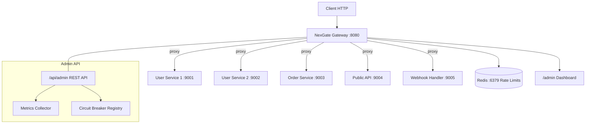

# NexGate &#8209; High-Performance API Gateway

<p align="center">
  <b>Asynchronous, event-driven API gateway built on Netty with Redis-backed rate limiting, JWT/OAuth2 auth, and circuit breaker resilience.</b>
</p>

<p align="center">
  
  
  
  
</p>

---

## Architecture



---

## Features

| Feature | Implementation |
|---------|---------------|
| **Async Proxy** | Non-blocking Netty HTTP pipeline with zero-copy buffering |
| **Route Matching** | Path pattern matching with wildcard and path-param support |
| **Load Balancing** | Round-robin and weighted round-robin across upstream services |
| **Auth Middleware** | JWT (HMAC-SHA), API Key, and OAuth2 Bearer token validation |
| **Rate Limiting** | Redis-backed sliding window counter + Lua-scripted token bucket |
| **Circuit Breaker** | State machine (CLOSED -> OPEN -> HALF_OPEN -> CLOSED) |
| **Admin Dashboard** | Built-in web UI at /admin with live metrics |
| **Admin REST API** | JSON endpoints for health, routes, circuit breaker state |
| **Metrics** | Request count, error count, active connections, uptime |
| **Docker** | Single Dockerfile + docker-compose with Redis and mock services |
| **YAML Config** | Declarative route configuration |

---

## Quick Start

### Prerequisites
- Java 21+
- Maven 3.8+
- Redis 7+ (or Docker)
- Docker and Docker Compose (optional, for full demo)

### Build
```bash
git clone https://github.com/ayushdixit1-av/nexgate-api-gateway.git
cd nexgate-api-gateway
mvn clean package -DskipTests
```

### Run with Docker
```bash
docker compose up --build
```

### Run locally
```bash
mvn clean package -DskipTests
java -jar target/nexgate-1.0.0.jar
```

---

## Dashboard

Open **http://localhost:8080/admin** in your browser:
- Metric cards: total requests, active connections, routes, circuit breakers
- Route table: IDs, paths, methods, auth, rate limits, upstreams, request/error counts
- Circuit breaker status with state and failure count per route
- Auto-refresh every 5 seconds

---

## Configuration

Edit `config/routes.yml`:

```yaml
port: 8080
routes:
  - id: user-service
    path: /api/users/**
    method: ANY
    auth: [jwt]
    rateLimit: 1000
    rateLimitDuration: 1m
    circuitBreaker:
      failureThreshold: 5
      successThreshold: 3
      timeoutMs: 30000
    upstreams:
      - host: localhost
        port: 9001
        weight: 3
      - host: localhost
        port: 9002
        weight: 2
```

### Route Fields

| Field | Required | Description |
|-------|----------|-------------|
| `id` | Yes | Unique route identifier |
| `path` | Yes | Path pattern (`/api/users`, `/api/users/{id}`, `/api/users/**`) |
| `method` | Yes | HTTP method or `ANY` |
| `auth` | No | List: `jwt`, `api-key`, `oauth2` |
| `rateLimit` | No | Max requests per window |
| `rateLimitDuration` | No | Window duration (`1s`, `1m`, `1h`) |
| `circuitBreaker` | No | Circuit breaker settings |
| `upstreams` | Yes | Array of backend services |

### Circuit Breaker Settings

| Field | Default | Description |
|-------|---------|-------------|
| `failureThreshold` | 5 | Consecutive failures to open |
| `successThreshold` | 3 | Successes to close (half-open) |
| `timeoutMs` | 30000 | Time before half-open retry |

---

## Admin REST API

### Health Check

```http
GET /api/admin/health
```

```json
{
  "status": "UP",
  "uptime": "0:05:23",
  "uptimeMs": 323000,
  "startTime": 1719650000000,
  "totalRequests": 142,
  "activeConnections": 3,
  "routesConfigured": 5
}
```

### Routes

```http
GET /api/admin/routes
```

### Circuit Breakers

```http
GET /api/admin/circuit-breakers
```

---

## Environment Variables

| Variable | Default | Description |
|----------|---------|-------------|
| `PORT` | `8080` | Gateway listen port |
| `REDIS_URL` | `redis://localhost:6379` | Redis connection string |
| `JWT_SECRET` | (dev default) | HMAC-SHA key for JWT validation |
| `NEXGATE_CONFIG` | `config/routes.yml` | Path to route configuration |

---

## Testing

```bash
mvn clean test
```

Tests cover:
- Circuit breaker state machine (CLOSED, OPEN, HALF_OPEN transitions)
- Round-robin and weighted round-robin load balancing
- Route pattern matching with path parameters
- Batch route matching

---

## Project Structure

```
src/main/java/com/nexgate/
  NexGateServer.java             # Entry point
  admin/
    AdminApiHandler.java         # REST API for admin dashboard
    MetricsCollector.java        # Request/error metrics tracking
    StaticFileHandler.java       # Serves admin frontend
  circuitbreaker/
    CircuitBreaker.java          # State machine implementation
    CircuitBreakerRegistry.java  # Singleton registry
  config/
    YamlConfigLoader.java        # SnakeYAML config parser
  gateway/
    HttpServerBootstrap.java     # Netty server bootstrap
    LoadBalancer.java            # Round-robin + weighted RR
    ProxyFrontendHandler.java    # Channel handler + request dispatcher
    RequestRouter.java           # Route matching, auth, rate limiting
    ReverseProxyHandler.java     # Upstream proxy with timeout
  middleware/
    AuthMiddleware.java          # JWT, API Key, OAuth2 validation
  model/
    Route.java                   # Route model with CircuitBreakerConfig
    RouteConfig.java             # Root config model
    UpstreamService.java         # Upstream host/port/weight
  ratelimit/
    RateLimiter.java             # Redis counter-based rate limiter
    TokenBucket.java             # Lua-scripted token bucket
src/main/resources/
  static/admin/index.html        # Admin dashboard frontend
  logback.xml                   # Logging configuration
```

---

## License

MIT
